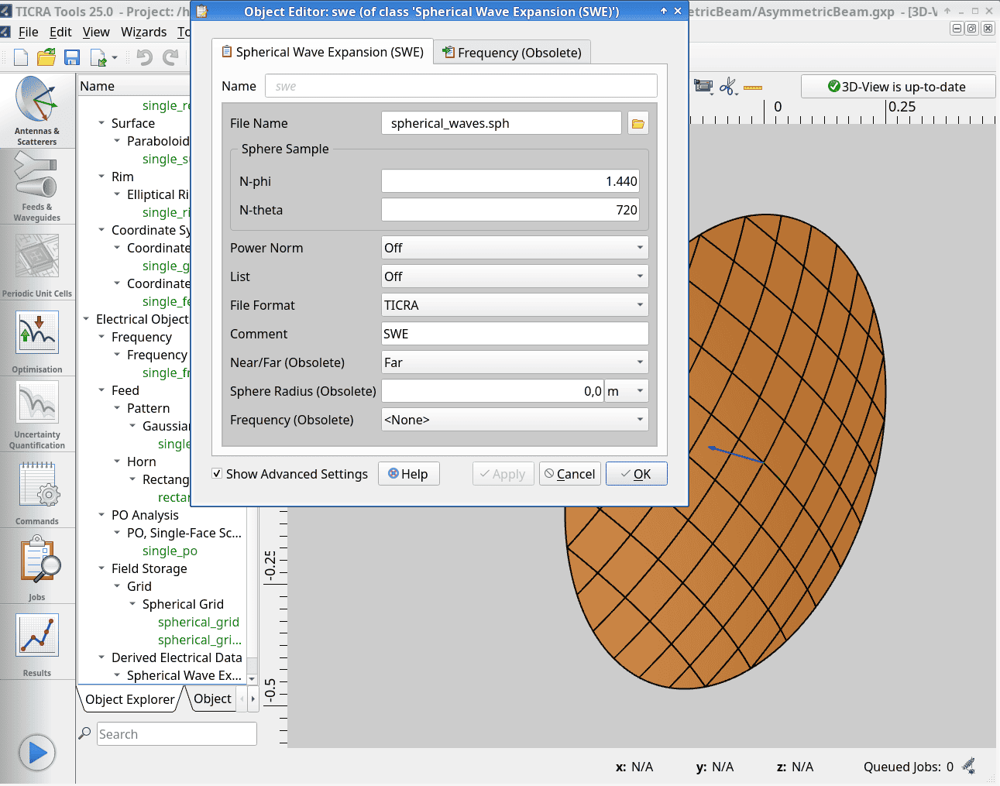
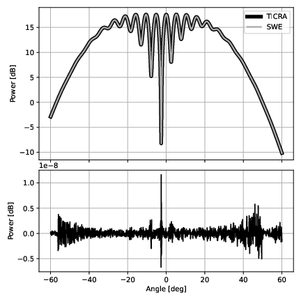

# Ungrasp — A converter for TICRA Spherical Wave Expansions

**Ungrasp is currently under active development alongside an upcoming companion paper (Tomasi et al., in prep). If you wish to use this tool for academic work prior to publication, please contact the authors.**

This repository contains Ungrasp, a Python library that bridges antenna engineering solvers and Cosmic Microwave Background (CMB) pipelines by directly manipulating TICRA Spherical Wave Expansion (SWE) files. By avoiding pixel-space interpolations, Ungrasp performs mathematically exact rotations in the purely harmonic domain, and high-fidelity phase-shift translations using projections free from integration errors. The software can transform the physical electric field into the spin-weighted Stokes parameters ($I, Q, U$) required by total-convolution codes, and evaluates the resulting fields onto arbitrary real-space grids and cuts.



## Why the name?

TICRA Tools models and outputs are inherently tied to specific local coordinate systems, nested bases, and strict proprietary conventions. `Ungrasp` is designed to “un-GRASP” your electromagnetic data—freeing the spherical harmonic coefficients from their rigid local frames and letting you analytically rotate, translate, and superimpose fields in a unified global environment.

## Features

- **Native SWE Parsing**: Directly ingests and parses binary and ASCII TICRA Spherical Wave Expansion files.
- **Spin-1 to Spin-2 Transformation**: Converts physical electric far-fields (spin-1) into Stokes parameters ($I, Q, U$) and maps them directly to the spin-weighted spherical harmonic coefficients ($a_{\ell m}^E$, $a_{\ell m}^B$) required by CMB total-convolution codes.
- **Exact Coordinate Rotations**: Implements exact 3D rigid-body rotations of harmonic coefficients using Wigner-$D$ matrices.
- **Phase-Shift Translations**: Features `ElectricField.translate_phase_center()`, utilizing spherical Bessel function padding to apply exact spatial translation phase shifts without introducing spatial aliasing.
- **Linear Superposition**: Enables direct algebraic addition (`+`) and subtraction (`-`) of multiple optical paths (e.g., combining main beam, subreflector spillover, and baffle blockage) in coefficient space.
- **Polarization Projections**: Comprehensive support for standard $\theta/\phi$ projections and Ludwig’s 3rd definition (with automatic mapping to the IAU polarization convention).
- **High-Performance Backend**: Powered by `ducc0` for ultra-fast, double-precision Spherical Harmonic Transforms.

## Validation

`Ungrasp` is verified to match native TICRA Tools evaluations to the literal numerical truncation limit of the ASCII files (~ −80 dB) across complex, highly oscillatory asymmetric interferometric patterns.



## Installation

The easiest way to add Ungrasp to your Python code is using `uv`:

```sh
uv add ungrasp
```


## Development setup

### Prerequisites

Ensure you have `uv` installed. You can grab the installer from the [Astral website](https://github.com/astral-sh/uv/releases) or run the following script from the command line:

```sh
curl -LsSf https://astral.sh/uv/install.sh | sh
```

### Installation Environments

We use dependency groups to keep the environment lean. Depending on your task, sync the environment using one of the following commands:

-   Standard Development (Tests, Linting, Typing):

    ```sh
    uv sync --group dev
    ```

-   Visualization & Research (JupyterLab, Matplotlib, Plotting):

    ```sh
    uv sync --group dev --group visualization
    ```

-   Documentation:

    ```sh
    uv sync --group docs
    ```

-   Minimal/Production (Library only):

    ```sh
    uv sync
    ```

### Building the documentation

The documentation is built using Sphinx. To build the HTML manual locally, simply use Nox:

```sh
uv run nox -s docs
```

The generated HTML files will be available in the `docs/_build/html` directory. You can open `docs/_build/html/index.html` in your web browser.

Alternatively, if you prefer to build the documentation without Nox, ensure you have synced the `docs` dependency group, then run:

```sh
uv run sphinx-build -b html docs/ docs/_build/html
```

### Working with Notebooks

If you are debugging or visually inspecting results using the visualization group, we recommend using the integrated Jupyter kernel.

-   Using VS Code / Cursor:

    1.   Open a .ipynb file.

    2.   Select the kernel associated with the .venv created by uv.

    3.   If the kernel isn't detected, ensure you have run `uv sync --group visualization`.

-   Using JupyterLab:

    ```sh
    uv run jupyter lab
    ```

    Note: The visualization group includes heavy dependencies like matplotlib and jupyterlab. These are excluded from the core library installation to keep the package lightweight for end-users.


### Cleaning the workspace

If you need to remove the virtual environment and start fresh, run the following commands:

```sh
rm -rf .venv
uv sync
```


## Licensing

This project is licensed under the EUPL v1.2. See [LICENSE.txt](./LICENSE.txt).

Please note that this library depends on [Ducc](https://gitlab.mpcdf.mpg.de/mtr/ducc/-/blob/ducc0/LICENSE), which is [licensed under the GPLv2](https://gitlab.mpcdf.mpg.de/mtr/ducc/-/blob/ducc0/LICENSE). When distributed together or used as a combined work, the terms of the GPL may apply to the combination as permitted by the EUPL v1.2 compatibility clause.

## Citation

A paper describing Ungrasp is currently being prepared. Contact the authors if you want to cite Ungrasp.
